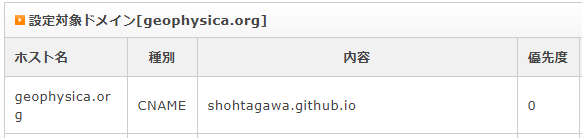

このページは、GitHub pagesで作成したページが、別のdomainに書き換えられるのかを試すために作ったものです。 
処理としては、CNAMEを書き換えただけです。残りはGitHub pagesがもともと、持っている機能を使用しています。 
<a href="https://docs.github.com/ja/github/working-with-github-pages/managing-a-custom-domain-for-your-github-pages-site#%E3%82%B5%E3%83%96%E3%83%89%E3%83%A1%E3%82%A4%E3%83%B3%E3%82%92%E8%A8%AD%E5%AE%9A%E3%81%99%E3%82%8B" target="_blank">基本的にはこちら</a>を参照しています。 

## このページの構成
このページはもともと、GitHub上で更新されている[https://ShohTagawa.github.io](https://ShohTagawa.github.io)です。 
個人所有しているdomainである、geophysica.orgのDNSのCNAME設定を変えて、そちらで見えるように致しました(下記に写真が表示されます)。 
    
※ サーバーは、xserver社のものです 
次に、時間待った後(DNSの順次更新)、GitHub側のSettingsにある、pages設定のCustum domainを登録しました。 
また、httpsをenforceする設定をonにしました。 
結果、カスタムdomainである、[https://geophysica.org/](http://geophysica.org/)で、[https://ShohTagawa.github.io](http://geophysica.org/)が表示されるようになりました。 

## リンクのテスト
アドレスを転送する上で、もっともネックになるのは、様々な階層のページに対する既存のリンクやブックマークが動かなくなることです。 
ここでは、その点について、テストします。 
下記は、リンクが動くかのテストです。下記のリンクタイプが想定され、それぞれ作ってみました。 
[リンク①](what_not_new)：おなじ階層の相対リンク。旧直リンクは、[https://ShohTagawa.github.io/what_not_new](https://ShohTagawa.github.io/what_not_new) 
[リンク②](support/)：一つ下の階層への相対リンク(index.md)。旧直リンクは、[https://ShohTagawa.github.io/support/](https://ShohTagawa.github.io/support/) 
[リンク③](support/howto)：一つ下の階層への相対リンク(howto.md)。旧直リンクは、[https://ShohTagawa.github.io/support/howto](https://ShohTagawa.github.io/support/howto) 
[リンク④](support/test.jpg)：一つ下の階層の画像ファイル。旧直リンクは、[https://ShohTagawa.github.io/support/test.jpg](https://ShohTagawa.github.io/support/test.jpg) 
[リンク⑤](support/howto#2方法)：一つ下の階層の相対リンク(howto.md)中のタグ1へのリンク。旧直リンクは、[https://ShohTagawa.github.io/support/howto#2方法](https://ShohTagawa.github.io/support/howto#2方法) 

## 気になる点   
- 英語ページへのリンクなどはきちんと動くか。   
- Googleのクロールは、どちらのサイトで登録されるか。   
- httpsの問題はないか。   

## 設定手順   
- 設定した手順については、howtoにのせました。