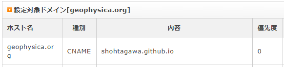
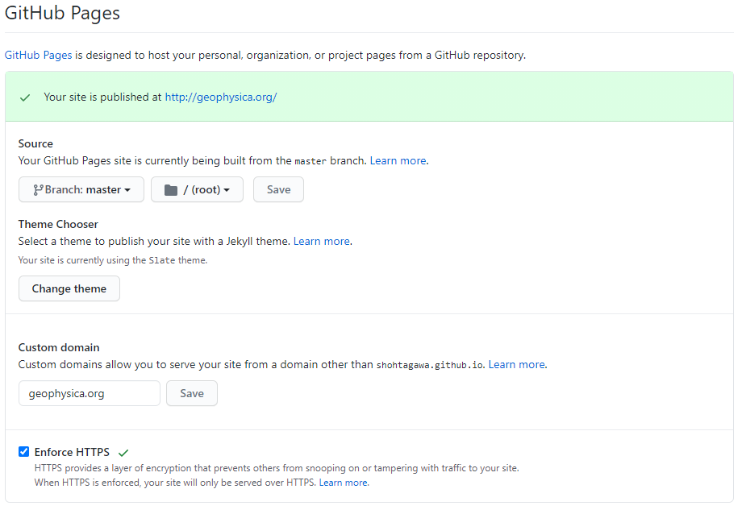

# 1前提  
このページは、GitHub Desktopで作成したページが、別のdomainへ転送出来るのかを試すために使われたものです。   
GitHub pagesで作成した時の、このページの旧リンクは、      
- https://ShohTagawa.github.io/support/howto  
ですが、これが、   
- https://geophysica.org/support/howto
と表示されます。
<br/>
<b>自分のための忘備録</b>
この機能は、DNS (Domain Name System)の設定によるものです。DNSは、ホスト名+ドメイン名とIPアドレスの間の対応を取る仕組みで、DNSサーバーにある記録に、CNAMEレコード(ホスト名+ドメイン名の別名のものに転送する記述)を登録することで実現しています。   <br>
登録の確認のコマンド(nslookup)を打つと、下記のように、geophysica.orgはshohtagawa.github.ioに転送されていることがわかります。<br>
```
home> nslookup -q=cname geophysica.org
...(色々出てくる)
geophysica.org  canonical name = shohtagawa.github.io
```
<br>
GitHub pagesの場合には、このCNAMEの設定によるカスタムドメインによるアクセス機能を取り込んでおり、SettingsのなかのGUIから、作る事ができます。

# 2方法
今回は、次のようにして導入しました。<br>
1. domain管理をしているサーバーで、CNAMEを登録。   
    
  ※最後に"."は必要でしょうか。例：shohtagawa.github.io"." (xserverだと、"."をつけると登録出来ません。最後の"."は、入れずに登録しています。)   
  ※CNAMEのdomain名は、case-insensitive values   
2. DNSを反映されるまで待つ。(大学のサーバーでCNAMEを書き換えた場合に、反映される場合の目安の時間がほしいです)   
3. GitHubのSettingsで、Custom Domainに、新しく表示させたいdomain名を登録します。   
    
  ※1と3の順番を逆にすると、たぶん、エラーが起きます。       
  ※この時点で、GitHubのtopディレクトリに、CNAMEというファイルが出来ます。   
4. この時点で、http (http://geophysica.org/)ならサイトには繋がるようになります。一方、https://geophysica.org/で打ち込むと、証明書エラーが戻る時間が、1時間ほどありました。しばらくく待つと、URLをhttpとしてもhttpsとしても、そのurlで表示されます。      
5. Enforce HTTPSのチェックが押します。これが押せるようになるまで、しばらく時間がかかります(今回は、6hで反映されました)。このオプションをonにすると、http://geophysica.org/は、http**s**://geophysica.org/に自動で変わるはずです。   
6. 以降は、問題なく、どちらのURL (つまり、https://ShohTagawa.github.io/ でもhttps://geophysica.org/でも)でも、全階層のページが閲覧可能になりました。<br>

# 3懸念点    
下記詳細を述べます   
1. 証明書エラーで、一定時間、http**s**://geophysica.org/につながらなくなりました。http**s**://ShohTagawa.github.io/と打っても、http://geophysica.org/に飛んでいた時間があったように思います。　　　
2. DNSの完全な反映に、どのくらい時間がかかるか不明です。→夜中に更新するしか無い?   
3. こちらの検証ページは、あと数日で停止します。   
[topへ](../index)